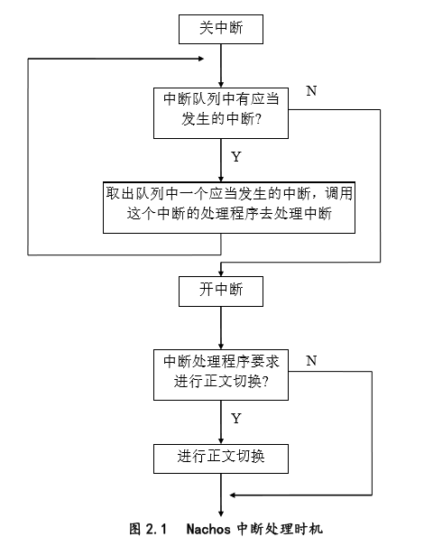
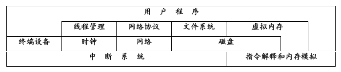
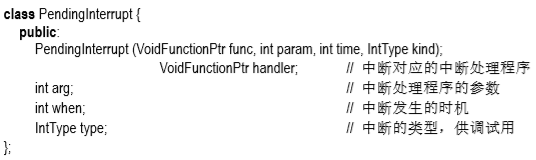
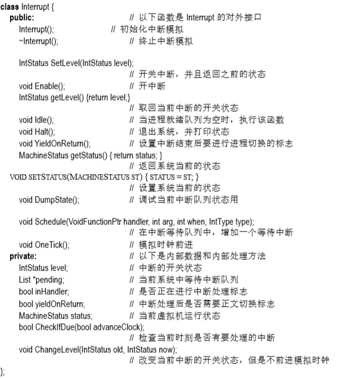

# Nachos机器模拟

### 一、概述

##### 1.1 Machine 类

​        Machine类使用来模拟计算机主机的。它的功能有：读写寄存器、读写主存、运行一条用户程序的汇编指令、运行用户程序、单步调试用户程序、显示主存和寄存器状态、将虚拟内存地址转换为物理内存地址、陷入 Nachos 内核等等。 

​        Machine 类实现方法是在宿主机上分配两块内存分别作为虚拟机的寄存器和物理内存。

​        运行 用户程序时，先将用户程序从 Nachos 文件系统中读出，写入模拟的物理内存中，然后调用指令模拟模块对每一条用户指令解释执行。将用户程序的读写内存要求，转变为对物理内存地址的读写。Machine 类提供了单步调试用户程序的功能，执行一条指令后会自动停下来， 让用户查看系统状态，不过这里的单步调试是汇编指令级的。

##### 1.2 Interrupt 类

​        Interrupt 类用来模拟硬件中断系统。在这个中断系统中，中断状态有开，关两种，中断类型 有时钟中断、磁盘中断、控制台写中断、控制台读中断、网络发送中断以及网络接收中断。 机器状态有用户态，核心态和空闲态。

​        在 Interrupt 类中有一个记录即将发生中断的队列，称为中断等待队列。中断等待队列中每个 等待处理的中断包含中断类型、中断处理程序的地址及参数、中断应当发生的时间等信息。 一般是由硬件设备模拟程序把将要发生的中断放入中断队列。中断系统提供了一个模拟机器时钟，机器时钟在下列情况下前进：1.用户程序打开中断 ；2.执行一条用户指令 ；3.处理机没有进程正在运行 。

​        在 Nachos 中只有在时钟前进时，才会检查是否有中断会发生，而 Nachos 模拟时钟前进的时机不是任意的，这样即使打开了中断，中断也不能在任意时刻发生。只有在模拟时钟前进的时候才能处理等待着的中断。通过以后的叙述我们可以看到，在执行非用户代码的大 部分时间里，系统不会被中断。这意味着不正确的同步代码可能在这个硬件模拟环境下工作正常，而实际上在真正的硬件上是无法正确运行的。 

##### 1.3 Time 类

​        Timer 类模拟定时器。定时器每隔 X 个时钟周期就向 CPU 发一个时钟中断。它是时间片管理必不可少的硬件基础。它的实现方法是将一个即将发生的时钟中断放入中断队列，到了时钟中断应发生的时候，中断系统将处理这个中断，在中断处理的过程中又将下一个即将发生的时钟中断放入中断队列，这样每隔 X 个时钟周期，就有一个时钟中断发生。 

​        由于 Nachos 是一个软件模拟的系统，有很多的随机事件需要通过一定的控制来实现。所以 系统中在计算下一个时钟中断应发生的时间时，还加入了一些随机值，使得中断发生的时间 间隔不确定，这样就与现实的定时器更相似。 

##### 1.4 Console 类

​        Console 类模拟的是控制台设备。当用户程序向控制台写一个字符时，写程序立即返回，过 了给定的时钟周期后 I/O操作完成，控制台向 CPU 发一个控制台写中断。但是控制台是否有用户输入可供读取是随机的，所以**控制台每隔给定的时钟周期向 CPU 发一个控制台读中断**，周期性地发中断的方法与定时器的类似，即先计算下一个控制台读中断将发生的时间， 然后将读中断放入中断队列，等待读中断的发生。读中断发生后，如果有用户输入的话，控制台读中断处理过程将控制台输入的字符放入**字符缓冲区**。当用户从控制台读字符时，把字符缓冲区的内容传给用户。**控制台的读/写分别用两个文件来模拟**。

##### 1.5 Disk 类

​       Disk 类模拟了物理磁盘，它一次只能接受一个读写请求，当读写操作完成后向 CPU 发一个磁盘中断。该物理磁盘只有一个面，分为几个磁道，每道又分为几个扇区。每道的扇区数， **每个扇区的存储容量都是固定的**。磁盘的使用者可以读写指定的扇区，**读写单位是一个扇区**。 模拟磁盘用宿主机文件系统中一个文件来实现。

​       当用户发出读写请求时，Nachos 的处理过 程如下: 1. 从模拟文件中读出数据或向模拟文件写入数据。 2. 计算磁盘操作需要的时间。磁盘操作时间 = 移动磁头寻道的时间 + 旋转到读写 扇区的时间 + 数据传送的时间。 3. 将一个磁盘读/写中断放入中断队列，因为中断是在操作完成后发生的。所以，中断发生时间 = 当前时间 + 磁盘操作时间。

##### 1.6 Network 类

​       每个 Nachos 运行时是宿主机上的一个进程，如果在宿主机上运行多个 Nachos 进程，这些 Nachos 进程可以组成一个网络，而每个 Nachos 进程就是一个网络节点。

​       Network 类模拟了 一个网络节点。这个网络节点可以把报文发送到网络的其他节点上。**报文的长度固定**，Nachos 模拟了在现实网络中时常发生的报文丢失的情况；但是报文中的内容不会在网络传送中被修改破坏。**每个网络节点都有全网络唯一的“地址”**，报文传送的起始节点、目的节点都是由 这个“地址”表示。 

​       报文在网络中的传递是用通过 **Socket（套接口）**来实现的。每个节点还有一个**可靠性系数**， 用来模拟报文从这个节点发出后丢失的概率。Network 的实现与控制台类似，每隔一定的时钟周期，就产生一个网络接收中断，网络接收中断处理过程是: 

1. 将下一个网络接收中断放入中断队列以实现中断的周期性发生。
2. 如果报文缓冲区中已有报文，则返回。 
3. 读取套接口，如果没有报文，则返回。 
4. 读取报文，把它放入报文缓冲区。 
5. 调用本节点自定义的接收处理函数。 

​        在**现有**实现中，报文缓冲区**只能存放一个报文**，有可能因为报文缓冲区满而造成报文丢失（上面第 2 行），可以多设几个报文缓冲区来减少丢失的可能性。 

​        Network 类提供了让网络用户读取已经收到的报文的成员函数，当报文缓冲区为空时，它返回空，否则从报文缓冲区读出报文，并将报文缓冲区清空，返回刚读出的报文。

​       报文发送的过程是: 

1. 将网络发送中断放入中断队列。 
2. 产生一个随机数。 
3. 如果这个随机数大于网络的可靠性系数，则不发送报文 (用来模拟报文丢失)，否则通过套接口将报文发送出去。 

##### 1.7 Nachos 整体结构

​        中断系统成为整个 Nachos 虚拟机的基础，其它的模拟硬件设备 都是建立在中断系统之上的。在此之上，加上 Machine 类模拟的指令解释器，可以实现Nachos 的线程管理、文件系统管理、虚拟内存、用户程序和网络管理等所有操作系统功能。

### 二、机器模拟的实现

#### 1.Sysdep 模块分析（System dependence）

Nachos 的运行环境可以是多种操作系统，由于每种操作系统所提供的系统调用或函数调用 在形式和内容上可能有细微的差别。sysdep 模块的作用是屏蔽掉这些差别。 

##### 1.1  PoolFile 函数 

语法： bool PoolFile (int fd) 

参数： fd - 文件描述符，也可以是一个套接字 (socket) 

功能： 测试一个打开文件 fd 是否有内容可以读，如果有则返回 TRUE，否则返回 FALSE。

##### 1.2 OpenForWrite 函数 

语法： int OpenForWrite (char *name) 

参数： name: 文件名 

功能： 为写操作打开一个文件。如果该文件不存在，产生该文件；如果该文件已经存在，则**将该文件原有的内容删除**。 

##### 1.3 OpenForReadWrite 函数 

语法： int OpenForReadWrite (char *name, bool crashOnError) 

参数： name:  文件名  ；crashOnError: crash 标志 

功能： 为读写操作打开一个文件。当 crashOnError 标志设置而文件不能读写打开时，系统出 错退出。 

##### 1.4 Read 函数 

语法： void Read (int fd, char *buffer, int nBytes) 

参数： fd:  打开文件描述符 ；buffer: 读取内容的缓冲区 ；nBytes: 需要读取的字节数 

功能： 从一个打开文件 fd 中读取 nBytes 的内容到 buffer 缓冲区。如果读取失败，系统退出。

##### 1.5 ReadPartial 函数 

语法： int ReadPartial (int fd, char *buffer, int nBytes) 

参数： fd:  打开文件描述符  ；buffer: 读取内容的缓冲区  ；nBytes: 需要读取的最大字节数 

功能： 从一个打开文件 fd 中读取 nBytes 的内容到 buffer 缓冲区，返回实际读出的字节数。 

##### 1.6 WriteFile 函数 

语法： void WriteFile (int fd, char *buffer, int nBytes) 

参数： fd:  打开文件描述符 ；buffer: 需要写的内容所在的缓冲区 ；nBytes: 需要写的内容最大字节数 

功能： 将 buffer 缓冲区中的内容写 nBytes 到一个打开文件 fd 中。 

##### 1.7 Lseek 函数 

语法： void Lseek (int fd, int offset, int whence) 

参数： fd: 文件描述符 ；offset: 偏移量 ；whence: 指针移动的起始点

 功能：移动一个打开文件的读写指针，含义同 lseek 系统调用；出错则退出系统。 

##### 1.8 Tell 函数 

语法： int Tell (int fd) 

参数： fd: 文件描述符 

功能： 指出当前读写指针位置 ，即返回当前指针位置

##### 1.9 Close 函数 

语法： void Close (int fd) 

参数： fd: 文件描述符 

功能： 关闭当前打开文件 fd，如果出错则退出系统。 

##### 1.10 Unlink 函数 

语法： bool Unlink (char *name) 

参数： name: 文件名 

功能： 删除文件。 删除成功，返回 TRUE；否则返回 FALSE。

##### 1.11 OpenSocket 函数 

语法： int OpenSocket () 

参数： 无 

功能： 申请一个 socket。 返回申请到的 socket ID。 

##### 1.12 CloseSocket 函数 

语法： void CloseSocket (int sockID) 

参数： sockID: socket 标识 

功能： 释放一个 socket。

##### 1.13 AssignNameToSocket 函数 

语法： void AssignNameToSocket(char *socketName, int sockID) 

参数： socketName: socket 文件名 ；sockID:  socket 标识 

功能： 将一个文件名和一个 socket 标识联系起来，于是将一个 SOCKET 文件同一个 Nachos 进程连接起来，使宿主机上该 Nachos 进程成为一个网络节点。 

##### 1.14 DeAssignNameToSocket 函数 

语法： void DeAssignNameToSocket(char *socketName) 

参数： socketName: socket 文件名 

功能： 将一个文件名删除，实际上是和相应的 socket 标识脱离关系。

##### 1.15 PoolSocket 函数 

语法： bool PoolSocket (int sockID) 

参数： socketID:  socket 标识 

功能： 查询一个 socket 是否有内容可以读取。 

##### 1.16 ReadFromSocket 函数 

语法： void ReadFromSocket (int sockID, char *buffer, int packetSize) 

参数： socketID:  socket 标识 ；buffer:  读取内容的暂存空间 ；packetSize: 读取数据包的大小 

功能： 从一个 socket 标识中读取 packetSize 大小的数据包，放在 buffer 缓冲中。 

##### 1.17 SendToSocket 函数 

语法： void SendToSocket (int sockID, char *buffer, int packetSize, char *toName) 

参数： socketID:  socket 标识 ；buffer:  发送内容的暂存空间 ；packetSize: 发送数据包的大小 ；toName:  要接收数据包的 Nachos 虚拟机模拟网络文件的文件名 

功能： 向 socket 标识中发送 packetSize 大小的数据包。 

##### 1.18 CallOnUserAbort 函数 

语法： void CallOnUserAbort (VoidNoArgFunctionPtr func) 

参数： func: 函数指针 

功能： 设定一个函数，在用户强制退出系统时调用。 实

##### 1.19 Delay 函数 

语法： void Delay (int seconds) 

参数： seconds: 需要延迟的秒数 

功能： 系统延迟一定的时间。 

##### 1.20 Abort 函数 

语法： void Abort () 

参数： 无 

功能： 退出系统 (非正常退出)。 

##### 1.21 Exit 函数 

语法： void Exit (int exitCode) 

参数： exitCode: 向系统的返回值 

功能： 退出系统。

##### 1.22 RandomInit 函数 

语法： void RandomInit (unsigned seed) 

参数： seed: 随机数产生魔数 

功能： 初始化随机数发生器。

##### 1.23 Random 函数 

语法： int RandomInit () 

参数： 无 

功能： 产生一个随机整数。 

##### 1.24 AllocBoundedArray 函数 

语法： char * AllocBoundedArray (int size) 

参数： size: 需要申请的空间大小 

功能： 申请一个受保护的存储空间。 申请成功后指针，该指针指向可以访问的申请空间，而不是指向受限区域的开始。 

##### 1.25 DeallocBoundedArray 函数 

语法： void DeallocBoundedArray (char *ptr, int size) 参数： ptr: 要释放空间的指针 size: 申请的空间大小 功能： 将受保护的存储空间释放。 

#### 2. Interrupt模块分析（文件interrupt.cc interrupt.h） 

​        中断模块的主要作用是模拟底层的中断机制。可以通过该模拟机制来启动和禁止中断 (SetLevel)；该中断机制模拟了 Nachos 系统需要处理的所有的中断。 

​        中断的发生总是有一定的时间。为了实现简单和便于统计各种活动所占用的时间起见，Nachos 规定系统时间在以下三种情况下前进：

- 执行用户态指令 
- 重新打开中断 
- 就绪队列中没有进程 

​        当前面两种情况需要时钟前进时，调用 OneTick 方法。OneTick 方法将系统态和用户态的时 间分开进行处理，这是因为用户态的时间计算是**根据用户指令**为单位的；而在系统态，没有 办法进行指令的计算，所以将系统态的一次中断调用或其它需要进行时间计算的单位设置为一个**固定值**，假设为一条用户指令执行时间的 10 倍。 

​        Nachos 线程运行有三种状态： 

- Idle 状态：系统 CPU 处于空闲状态，没有就绪线程可以运行。如果中断等待队列中有需要处理的 除了时钟中断以外的中断，说明系统还没有结束，将时钟调整到发生中断的时间，进行中断处理；否则认为系统结束所有的工作，退出。

- 系统态：Nachos 执行系统程序。Nachos 虽然模拟了虚拟机的内存，但是 Nachos 系统程序本身的 运行不是在该模拟内存中，而是利用宿主机的存储资源。

- 用户态：系统执行用户程序。当执行用户程序时，每条指令占用空间是 Nachos 的模拟内存。

​        Nachos 需要处理的中断种类有： TimerInt- 时钟中断 ；DiskInt- 磁盘（读/写）中断 ；ConsoleWriteInt- 终端写中断 ；ConsoleReadInt- 终端读终端 ；NetworkSentInt- 网络发送中断 ；NetworkRecvInt- 网络接收中断； 

​        中断处理程序是在某种特定的中断发生时被调用，中断处理程序的作用包括可以在现有的模 拟硬件的基础上建立更高层次的抽象。比如现有的模拟网络是有丢失帧的不安全网络，在中 断处理程序中可以加入请求重发机制来实现一个安全网络。

##### 2.1 PendingInterrupt类 

这个类定义了一个中断等待队列中需要处理的中断。初始化函数就是为 对应的参数赋值。 

 

##### 2.2  Interrupt类

其中，Schedule 和 OneTick 两个方法除虚拟机模拟部分外的其它类方法是不能调用这两个方法的。

##### 2.2.1 内部使用方法：CheckIfDue 方法 

语法： bool CheckIfDue (bool advanceClock) 

参数： advanceClock: 时钟前进标志。当系统处于 Idle 状态时，时钟直接跳到等待中断队列第一项规定的时间。是否需要这样做，由 advanceClock 标志来决定。 

功能： 测试当前等待中断队列中是否要有中断发生，如果不存在任何中断，返回 FALSE。。

##### 2.2.2 对外接口：OneTick方法 

语法： void OneTick () 

功能： 时钟前进一个系统态\用户态时间单位

实现： 1. 根据当前状态为用户态或是系统态时钟分别前进一个用户态时间单位或系统态时间单位，并且对 Nachos 运行的各项时间（用户态时间、系统态时间）进行统 计。 2. 检查当前时刻是否有中断发生；如果有，进行中断处理 3. 如果 yieldOnReturn 标志设置，作进程切换 

##### 2.2.3 对外接口：YieldOnReturn方法

语法： void YieldOnReturn () 

功能： 设置 yieldOnReturn 标志 该方法必须在中断处理程序中调用，比如时钟中断处理的最后可能会引起进程切换就需要调用该方法。 

##### 2.2.4 对外接口：Idle方法

语法： void Idle () 

功能： 系统处于 Idle 状态时调用该方法 (见 Thread 类 Sleep 方法)，检查当前等待中断队列中是否有待处理的中断，如果有处理该中断。 

实现： 检查等待中断队列是否有中断要发生 1. 如果有 1.1. 将系统时钟调整到第一个待处理中断的发生时间，处理该中断。（调用 CheckIfDue，并将 advanceClock 设置为 TRUE） 1.2. 处理在新的时刻其它需要发生的中断。 2. 如果没有，退出系统。 

##### 2.2.5 对外接口：Schedule方法

语法： void Schedule (VoidFunctionPtr handler, int arg, int fromNow, IntType type) 

参数： handler: 中断处理函数 arg:  中断处理函数的参数 fromNow: 中断发生的时刻和现在时刻的差值 type:  中断的类型 

功能： 将一个中断插入等待处理中断队列。 

##### 2.2.6 对外接口：DumpState方法

语法： void DumpState () 

功能： 调用 PrintPending 函数，打印出当前等待中断队列中的所有中断的状态。 

#### 3. 时钟中断模块分析（文件timer.cc timer.h） 

​        该模块的作用是模拟时钟中断。Nachos 虚拟机可以如同实际的硬件一样，每隔一定的时间会发生一次时钟中断。**这是一个可选项，目前 Nachos 还没有充分发挥时钟中断的作用**，只有在Nachos指定线程随机切换时，（Nachos -rs参数，见线程管理部分Nachos主控模块分析） 启动时钟中断，在每次的时钟中断处理的最后，加入了线程的切换。

​        实际上，时钟中断在线程管理中的作用远不止这些，时钟中断还可以用作： 

1. 线程管理中的时间片轮转法的时钟控制，（详见线程管理系统中的实现实例中，对线程调度的改进部分）不一定每次时钟中断都会引起线程的切换，而是由该线程是否的时间片是否已经用完来决定。
2. 分时系统线程优先级的计算（详见线程管理系统中的实现实例中，对线程调度的改进部分）
3. 线程进入睡眠状态时的时间计算 可以通过时钟中断机制来实现 sleep 系统调用，在时钟中断处理程序中，每隔一定的时间对定时睡眠线程的时间进行一次评估，判断是否需要唤醒它们。

​        Nachos 利用其模拟的中断机制来模拟时钟中断。时钟中断间隔由 TimerTicks 宏决定（100 倍 Tick 的时间）。在系统模拟时有一个缺陷，如果系统就绪进程不止一个的话，每次时钟中断都一定会发生进程的切换（见 system.cc 中 TimerInterruptHandler 函数）。所以运行 Nachos 时，如果以同样的方式提交进程，系统的结果将是一样的。这不符合操作系统的运行不确定性的特性。所以在模拟时钟中断的时候，加入了**一个随机因子**，如果该因子设置的话，时钟 中断发生的时机将在一定范围内是随机的。。这样有些用户程序在同步方面的错误就比较容易 发现。但是这样的时钟中断和真正操作系统中的时钟中断将有不同的含义。不能象真正的操作系统那样通过时钟中断来计算时间等等。**是否需要随机时钟中断可以通过设置选项(-rs)来 实现**。 

​        Timer 类的实现很简单，当生成出一个 Timer 类的实例时，就设计了一个模拟的时钟中断。 

​       在 Timer 的初始化函数中，借用 TimerHandler 内部函数

#### 4. 终端设备模块分析（文件console.cc console.h） 

​        该模块的作用是模拟实现终端的输入和输出，即键盘的输入和显示输出。终端输入输出的模拟是异步的，也就是说当发出终端的输入输出请求后系统即返回，需要等待中断发生后才是真正完成了整个过程。

​        Nachos 的终端模拟借助了两个文件，即在生成函数中的 readFile 和 writeFile。这两个文件分 别模拟键盘输入和屏幕显示。当 readFile 为 NULL 时，Nachos 以标准输入作为终端输入；当 writeFile 为 NULL 时，Nachos 以标准输出作为终端输出。 

#### 5.磁盘设备模块分析（文件disk.cc disk.h） 

​        磁盘设备模拟了一个物理磁盘。Nachos 用宿主机中的一个文件来模拟一个单面物理磁盘， 该磁盘由道组成，每个道由扇区组成，而每个扇区的大小是固定的。和实际的物理磁盘一样， Nachos 以扇区为物理读取/写入的最小单位，**每个扇区有唯一的扇区地址**，具体的计算方法 是： 

​        **track * SectorsPerTrack + offset**

 

#### 6.Nachos运行情况统计（文件stats.cc stats.h） 

