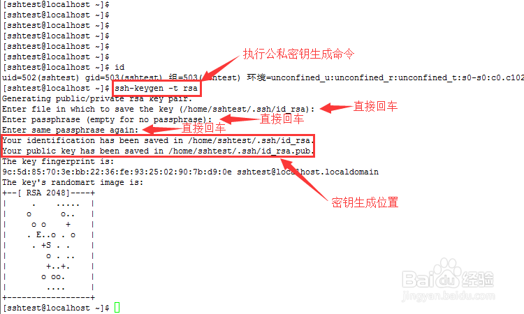

## SSH Connection Without Password

When connecting another system by the way of ssh-remote-login, you need enter the remote host's password every time. It is troublesome. 

Now, perform the following steps:

### Step1: Generate the key file

Enter the command bellow on local system to generate the key file.

``` bash
ssh-keygen -t rsa
```



### Step2: Transfer  the key file

Enter the command bellow on local system to transfer  the key file to the remote system

``` bash
ssh-copy-id -i ~/.ssh/id_rsa.pub 用户名@IP地址
# for example
ssh-copy-id -i ~/.ssh/id_rsa.pub dss@10.164.194.42
```

## Conclusion

It is finished! If meeting a few little problem about the key file such as "no file", you can perform the command bellow.

``` bash
cd
rm -rf ~/.ssh
```

Then, repeat the above procedure!
